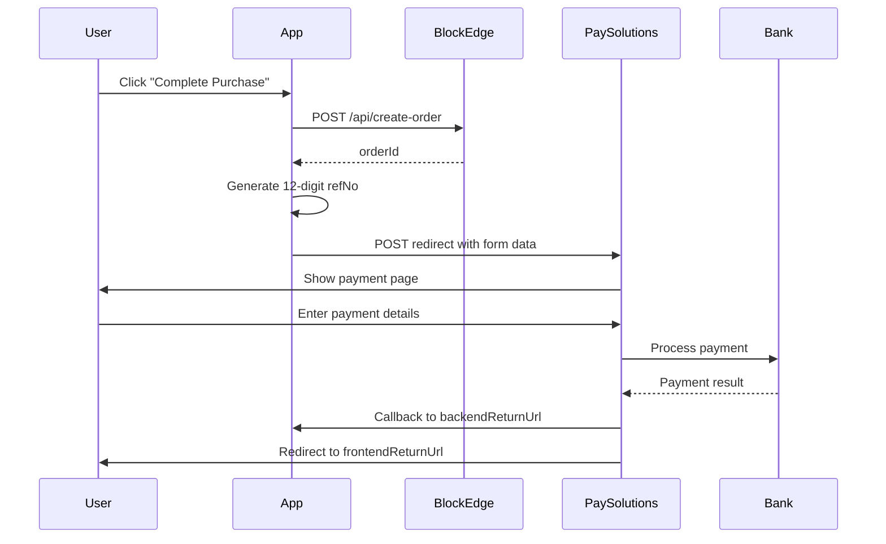

# PaySolutions Payment Integration Guide

## Overview

This document explains how to integrate with PaySolutions payment gateway for the Carbon Credit Landing page. The integration uses HTTP POST redirect method to send users to PaySolutions payment page.

## API Endpoint

```
POST https://payments.paysolutions.asia/payment
```

## Required Form Fields

### Core Payment Fields

| Field | Type | Required | Description | Example |
|-------|------|----------|-------------|---------|
| `merchantId` | string | ✅ | Merchant identifier from PaySolutions | `62551562` |
| `refNo` | string | ✅ | **12-digit random number** | `847392610583` |
| `amount` | string | ✅ | Payment amount (2 decimal places) | `1.00` |
| `currencyCode` | string | ✅ | Currency code | `THB` |
| `productDetail` | string | ✅ | **Use orderId here** | `ORDER_67890_TEST` |

### Customer Information

| Field | Type | Required | Description | Example |
|-------|------|----------|-------------|---------|
| `customerName` | string | ✅ | Customer full name | `Test User` |
| `customerEmail` | string | ✅ | Customer email address | `test@example.com` |
| `customerPhone` | string | ✅ | Customer phone number | `0801234567` |

### Return URLs

| Field | Type | Required | Description | Example |
|-------|------|----------|-------------|---------|
| `backendReturnUrl` | string | ✅ | Server callback URL | `https://domain.com/api/payment/callback` |
| `frontendReturnUrl` | string | ✅ | Success redirect URL | `https://domain.com/payment/success` |
| `successReturnUrl` | string | ❌ | Alternative success URL | `https://domain.com/payment/success` |
| `failReturnUrl` | string | ❌ | Failed payment URL | `https://domain.com/payment/fail` |

### Optional Fields

| Field | Type | Required | Description | Example |
|-------|------|----------|-------------|---------|
| `lang` | string | ❌ | Interface language | `TH` or `EN` |

## 🎯 Critical Solution

### The 500 Error Fix

PaySolutions was returning 500 errors due to incorrect field formats. The solution:

1. **refNo**: Must be a **12-digit random number**
   ```javascript
   const refNo = Math.floor(Math.random() * 999999999999).toString().padStart(12, '0')
   ```

2. **productDetail**: Must contain the **orderId** (not a description)
   ```javascript
   const productDetail = orderId // e.g., "ORDER_67890_TEST"
   ```

## Implementation

### 1. Create Order via BlockEdge API

```typescript
// Call BlockEdge API to create order
const orderId = await createOrder({
  projectId: "forest-restoration",
  duration: "30",
  price: 299,
  co2: 930,
  autoRenewal: false
})
```

### 2. Generate Payment Form

```html
<form method="POST" action="https://payments.paysolutions.asia/payment">
  <!-- Core fields -->
  <input type="hidden" name="merchantId" value="62551562" />
  <input type="hidden" name="refNo" value="847392610583" />
  <input type="hidden" name="amount" value="299.00" />
  <input type="hidden" name="currencyCode" value="THB" />
  <input type="hidden" name="productDetail" value="ORDER_67890_TEST" />
  
  <!-- Customer info -->
  <input type="hidden" name="customerName" value="Test User" />
  <input type="hidden" name="customerEmail" value="test@example.com" />
  <input type="hidden" name="customerPhone" value="0801234567" />
  
  <!-- Return URLs -->
  <input type="hidden" name="backendReturnUrl" value="https://domain.com/api/payment/callback" />
  <input type="hidden" name="frontendReturnUrl" value="https://domain.com/payment/success?orderId=ORDER_67890_TEST" />
  <input type="hidden" name="failReturnUrl" value="https://domain.com/payment/fail?orderId=ORDER_67890_TEST" />
  
  <!-- Optional -->
  <input type="hidden" name="lang" value="TH" />
</form>
```

### 3. Auto-Submit Form

```typescript
useEffect(() => {
  const timer = setTimeout(() => {
    const form = document.getElementById('payso-form') as HTMLFormElement
    if (form) {
      form.submit() // Auto-redirect to PaySolutions
    }
  }, 1500)
  return () => clearTimeout(timer)
}, [])
```

## Payment Flow



## Callback Handling

### Backend Callback (`/api/payment/callback`)

```typescript
export async function POST(request: NextRequest) {
  const body = await request.json()
  
  // Verify payment status
  // Update database
  // Send confirmation email
  // Update BlockEdge order status
  
  return NextResponse.json({ status: 'received' })
}
```

### Frontend Redirect

- **Success**: `/payment/success?orderId=ORDER_67890_TEST`
- **Failure**: `/payment/fail?orderId=ORDER_67890_TEST&error=payment_failed`

## Testing

### Test Data

```javascript
const testPayment = {
  merchantId: "62551562",
  refNo: "123456789012", // 12 digits
  amount: "1.00",         // ฿1 for testing
  currencyCode: "THB",
  productDetail: "ORDER_TEST_123",
  customerName: "Test User",
  customerEmail: "test@example.com",
  customerPhone: "0801234567"
}
```

### Test URLs

- **Development**: `http://localhost:3000`
- **Test Payment**: Select "1 Day (Test)" for ฿1

## Troubleshooting

### Common Issues

1. **500 Error**: 
   - ✅ **Fixed**: Use 12-digit random refNo + orderId in productDetail

2. **Invalid Amount**: 
   - Ensure amount has 2 decimal places: `"1.00"` not `"1"`

3. **Missing Required Fields**: 
   - All core fields must be present and non-empty

4. **URL Format**: 
   - Return URLs must be absolute URLs with protocol

### Debug Information

The payment form shows real-time debug information including:
- Generated refNo (12-digit random)
- productDetail (orderId)
- All form fields being sent to PaySolutions

## Production Checklist

- [ ] Update merchantId to production value
- [ ] Set production return URLs
- [ ] Remove debug information
- [ ] Enable error logging
- [ ] Test callback handling
- [ ] Verify SSL certificates
- [ ] Set up monitoring

## Security Notes

- Never expose sensitive merchant credentials in frontend code
- Validate all callback data from PaySolutions
- Use HTTPS for all return URLs
- Implement proper error handling
- Log all payment transactions for auditing

---

*Generated for Carbon Credit Landing - PaySolutions Integration*